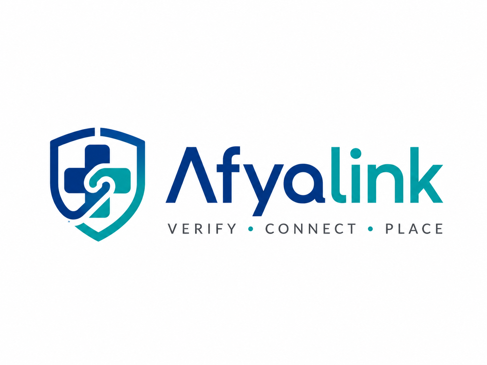

# Afyalink



Afyalink is a secure healthcare professional verification, assessment, and placement platform.

The platform is designed to help healthcare professionals submit credential records, give consent for verification, pay required review/interview fees, and track application status. It also gives Afyalink administrators verification/interview workbenches and gives approved healthcare facilities subscription-gated access to published, read-only, watermarked candidate profiles.

## Product Direction

Afyalink is not just a recruitment site. It is a trust infrastructure layer for healthcare staffing:

- verify healthcare professional identity and credentials;
- protect sensitive documents using private storage and controlled access;
- record consent, payment, review, and workflow decisions;
- support admin review, interview scoring, and recommendation workflows;
- operate facility subscriptions, controlled candidate viewing, recommendations, and placement requests.

## Milestone 1 Scope

Milestone 1 focuses on the foundation:

- professional registration, authentication, email verification, and password reset;
- professional profile completion;
- credential document upload;
- consent capture and consent versioning;
- payment reference or M-PESA-ready payment domain;
- application submission workflow;
- admin review workflow with replacement requests and review notes;
- notification/outbox-ready communication events;
- audit logs for all sensitive actions;
- private document storage design;
- secure, scalable architecture ready for later facility access.

Out of scope for Milestone 1:

- full facility marketplace;
- automated regulatory integrations unless a verified API exists;
- AI matching engine;
- unrestricted facility access to professional documents.

## Recommended Stack

The source documents recommend a secure modular monolith:

- Backend/domain core: Laravel 13 / PHP 8.3+
- Frontend: React with Next.js App Router, or Laravel Inertia + React
- Database: PostgreSQL
- Cache/queue: Redis
- Storage: private S3-compatible object storage such as AWS S3 or Cloudflare R2
- Payments: M-PESA Daraja
- Authentication: Laravel Sanctum/Fortify, MFA-ready
- Admin: Filament, custom Laravel admin, or React dashboard
- CI/CD: Docker and GitHub Actions

## Repository Structure

```text
afyalink/
  apps/
    api/                 # Backend application will live here
    web/                 # Frontend application will live here if separate Next.js is chosen
  assets/
    brand/               # Logo and brand assets
  docs/
    architecture/        # Engineering architecture decisions
    milestones/          # Milestone implementation plans
    security/            # Security and privacy design
    source/              # Original planning DOCX files
```

## First Engineering Decision

Start with a secure modular monolith. Do not start by building every future module. The first working release must make identity, credentials, documents, consent, payments, workflow state, and audit logs correct from day one.

## Local Setup Status

This repository now includes an executable Milestone 1 vertical slice. The backend is still framework-light so trust-critical rules can be tested clearly, but it now exposes real API routes for registration, login, email verification, password reset, profile completion, credential upload, consent, payment reference creation, application submission, admin review, payment review, credential review, and audit log review.

## Current Engineering Foundation

- Application workflow state machine.
- Payment workflow state machine.
- Professional profile value object.
- Credential record value object.
- Full application submission service.
- Account lifecycle service for email verification and password reset.
- Notification outbox service for verification, reset, submission, and replacement events.
- Admin review service.
- Role and permission matrix.
- Signed private document URL factory.
- Payment intent factory with idempotency behavior.
- Priority regulatory body registry.
- Credential document requirement registry.
- Submission readiness checker.
- Consent version validation.
- Private credential file upload policy.
- Audit event factory with secret redaction.
- PostgreSQL Milestone 1 schema.
- Milestone 1 API contract.
- Framework-light API kernel and HTTP controllers.
- PostgreSQL-backed runtime repository adapter.
- JSON persistence retained only for explicit test/dev fixture mode.
- Local private and S3-compatible credential storage adapters.
- Professional and admin workflow endpoints.
- Interactive web intake/admin console with step-based onboarding, replacement request visibility, admin counters, review timeline, and account recovery forms.
- Facility marketplace platform covering facility onboarding, admin approval, access subscriptions, candidate publication, gated candidate browsing, watermarked candidate detail views, appointment requests, recommendation requests/packages, and facility operations counters.
- Premium public landing page positioning Afyalink as trusted healthcare verification infrastructure.
- GitHub Actions CI foundation.
- Next.js App Router web platform with multi-page public site, routed auth, and separate professional, facility, and admin portals.

## Run Locally

Backend:

```bash
cd apps/api
composer install
composer dump-autoload
php scripts/migrate.php
composer check
php -S localhost:8000 -t public
```

For local PostgreSQL/MinIO infrastructure:

```bash
docker compose up -d postgres minio
```

Frontend:

```bash
cd apps/web
npm install
npm.cmd run check
npm.cmd run typecheck
npm.cmd run build
```

Run the routed Next.js frontend:

```bash
npm.cmd run dev
```

The browser API client calls `http://localhost:8000` by default. Set `NEXT_PUBLIC_AFYA_API_BASE` to point it at another API.

## Local Checks

```bash
cd apps/api
composer dump-autoload
php scripts/migrate.php # when DATABASE_URL is configured
composer check

cd ../web
npm.cmd run check
npm.cmd run typecheck
npm.cmd run build
```

The current tests verify:

- email verification tokens are generated, expire, and cannot be reused unsafely;
- password reset requests avoid user enumeration and rotate credentials;
- unsafe application status jumps are blocked;
- duplicate payment confirmation transitions are blocked;
- profile, credential, consent, and payment readiness rules work;
- public credential storage paths are rejected;
- audit metadata redacts secrets;
- consent is tied to exact active wording and version.
- a complete professional application can be submitted only when ready;
- final submission is blocked until the professional email is verified;
- replacement requests notify the professional and supersede prior documents when a replacement is uploaded;
- admin review can approve only through valid transitions;
- facility viewers cannot access raw credential documents;
- signed document links are viewer-bound and expiring;
- payment intent references are idempotent.
- unapproved facilities and facilities without active access cannot browse candidates;
- candidate publication requires qualified/approved application state, passed verification, completed recommended interview, and current consent;
- candidate profile views are watermarked and audited;
- facility requests and recommendation packages persist through admin-managed workflows.

## Render Staging

This repository now includes `render.yaml` and an API `Dockerfile` for Render staging:

- API: Render Docker web service running PHP 8.3, PostgreSQL migrations, and the API public router.
- Database: Neon PostgreSQL through `DATABASE_URL`.
- Web: Render Node web service running the Next.js frontend from `apps/web`.
- Credential files: temporary local staging storage at `/tmp/afyalink/credentials`.

Read the deployment guide before using staging credential uploads:

- [Render Staging Deployment](docs/deployment/render-staging.md)

## Documents

- [Milestone 1 Plan](docs/milestones/milestone-1.md)
- [Milestone 3 Facility Marketplace](docs/milestones/milestone-3.md)
- [Technical Direction](docs/architecture/technical-direction.md)
- [Facility Platform Architecture](docs/architecture/facility-platform-architecture.md)
- [Candidate Publication and Access Control](docs/architecture/candidate-publication-access-control.md)
- [Security Foundation](docs/security/security-foundation.md)
- [Secure Candidate Viewing](docs/security/secure-candidate-viewing.md)
- [Recommendation Workflow](docs/workflows/recommendation-workflow.md)
- [Public Landing Page](docs/product/public-landing-page.md)
- [Next.js Web Platform Architecture](docs/architecture/nextjs-web-platform.md)
- [Local Setup](docs/setup.md)
- [Milestone 1 API Endpoints](docs/api/milestone-1-endpoints.md)
- [Milestone 3 API Endpoints](docs/api/milestone-3-endpoints.md)
- [Docs Index](docs/README.md)
